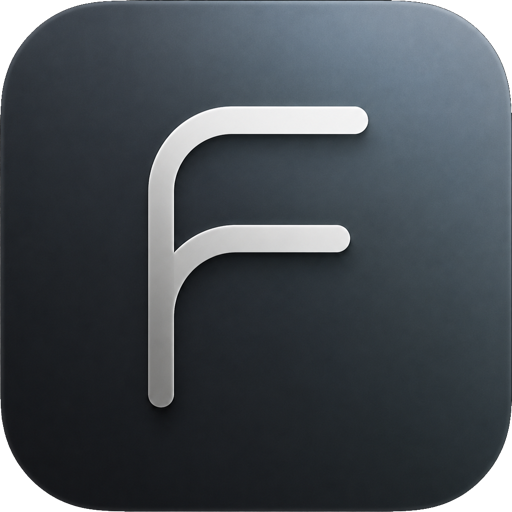
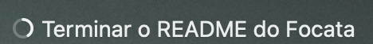
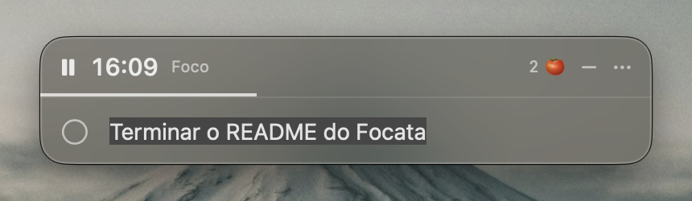

<div align="center">



# Focata

**Uma tarefa por vez na barra de menu, com um Pomodoro que você lê num relance.**


<br>



</div>

<br>

No lugar de `24:59, 24:58…`, um anel ao lado do texto se preenche em sentido horário, como o progresso de um download. A cor diz o modo: **claro para foco**, **verde para o tempo livre**. Cada troca avisa com uma notificação discreta. Concluir uma tarefa não a faz sumir: ela fica riscada, até você limpar.

Sem pastas, sem tags, sem prioridades. Cada um desses recursos seria mais uma decisão e mais uma forma de procrastinar organizando em vez de fazendo. A ideia de fixar uma tarefa só na barra vem do [One Thing](https://sindresorhus.com/one-thing), do Sindre Sorhus.

## Baixar

[**Baixe o .dmg na página de releases**](../../releases/latest). Abra, arraste o Focata para a pasta Aplicativos e pronto. Roda em macOS 14 ou mais novo, em Apple Silicon e em Intel.

O app é assinado ad-hoc, sem Developer ID, então na primeira vez o macOS vai barrar. Abra **Ajustes do Sistema › Privacidade e Segurança**, role até o aviso sobre o Focata e clique em **Abrir mesmo assim**. Se preferir resolver pelo terminal:

```sh
xattr -d com.apple.quarantine /Applications/Focata.app
```

Depois de instalado, o Focata pergunta ao GitHub se saiu versão nova — quando você liga o Mac, e uma vez por dia — e avisa com um alerta. "Baixar" leva direto ao `.dmg` da versão nova; os outros botões são "Depois" e "Ignorar esta versão". A pergunta é anônima, nada do que você escreve sai do Mac e nada é baixado sem o seu clique. Dá para desligar em **Configurações › Geral**, e para perguntar na hora pelo menu ou pelo botão "Verificar agora".

## O que ele faz

<div align="center">

</div>

**Na barra**
- Uma tarefa por vez, com Markdown (negrito, itálico, tachado, links).
- Anel de Pomodoro que se preenche de 0 a 100%, com check breve ao concluir o ciclo e `||` no meio quando a sessão está pausada.
- Cadeado quando a sessão é privada.
- Tooltip com o tempo restante, para quando você quiser o número.

**Fluxo**
- Clique no **anel** inicia ou pausa o foco; clique no **texto** abre a caixa da tarefa, centralizada.
- A caixa tem barra de título própria: play/pause, tempo do ciclo, pomodoros da tarefa, botão de minimizar e três pontinhos com o mesmo menu do clique direito.
- A caixa cresce com o texto até cinco linhas, sempre pela borda de baixo; passando disso o campo rola por dentro, com o cursor à vista.
- `return`/`esc` minimizam a caixa, **shift**+clique limpa, clique direito abre o menu.
- Arraste um item do Lembretes, do Things ou qualquer texto sobre o ícone para definir a tarefa.
- O check redondo na caixa conclui a tarefa: ela entra no histórico e a barra fica limpa para a próxima.
- Com a caixa aberta, a tarefa concluída sai de cena antes de o campo ficar em branco: o risco atravessa uma linha de cada vez — com o barulho de giz no papel a cada traço —, o texto se desfaz e o convite da próxima sobe no lugar.
- Se preferir manter o texto riscado à mostra (Configurações › Pomodoro), o check vira interruptor: clicar de novo reabre a tarefa.

**Histórico**
- Concluídas e abandonadas, com data e número de pomodoros.
- Depende da opção "Limpar a barra". Com o texto riscado à mostra, a conclusão é reversível pelo check, e registro que se desfaz não é registro: nesse modo nada vai para o histórico, nem concluída, nem abandonada.
- Apagar entrada a entrada, ou tudo.
- **Modo privado**: a sessão roda normalmente, mas não deixa rastro nenhum.

**Configurações** em quatro abas: Geral, Aparência, Pomodoro e Atalhos.
Geral traz abrir junto com o Mac, histórico, o comportamento do editor e a verificação de atualizações, com a versão instalada à vista.
Aparência com prefixo/sufixo, largura máxima, tamanho, largura da fonte, negrito e cor.
Durações ajustáveis (padrão 25/5/15, pausa longa a cada 4 ciclos) com presets *Clássico 25/5*, *Longo 50/10* e *Sprint 15/3*.

## Automação

Dá para pilotar o Focata sem encostar na barra.

**Esquema de URL**

```sh
open --background 'focata:?text=Exercitar'   # define a tarefa
open --background 'focata://start'           # inicia ou retoma
open --background 'focata://pause'
open --background 'focata://toggle'
open --background 'focata://skip'            # pula o ciclo (não conta pomodoro)
open --background 'focata://reset'           # volta ao foco e zera a contagem
open --background 'focata://complete'        # conclui (texto fica riscado)
open --background 'focata://clear'
open --background 'focata://edit'            # abre o editor
open --background 'focata://private?on=1'    # sem `on`, alterna
```

**Terminal**

```sh
defaults read dev.vinicius.focata text
```

**App Atalhos:** Definir tarefa, Obter tarefa atual, Iniciar foco, Pausar timer, Pular ciclo, Concluir tarefa, Alternar modo privado.

**Serviços:** selecione texto em qualquer app e use *Serviços › Enviar para o Focata*.

**Atalhos globais:** cinco, configuráveis na aba Atalhos. Nenhum vem definido de fábrica, para não roubar teclas que você já usa.

## Build

Requer macOS 14+ e Xcode 26+.

```sh
brew install xcodegen
xcodegen generate
xcodebuild -project Focata.xcodeproj -scheme Focata -configuration Release -derivedDataPath build build
open build/Build/Products/Release/Focata.app
```

Ou use `./scripts/build.sh` (aceita `debug`, `release`, `test`).

O `project.yml` é a fonte da verdade: o `.xcodeproj` é gerado e não vai para o repositório. A assinatura é ad-hoc (`CODE_SIGN_IDENTITY: "-"`, sem `DEVELOPMENT_TEAM`), então qualquer pessoa clona e builda sem configurar nada.

Para gerar o instalador:

```sh
./scripts/dmg.sh          # → dist/Focata-<versão>.dmg
```

O script builda em Release, monta a imagem com o app e o atalho para Aplicativos, ajusta o layout da janela e comprime.

## Testes

```sh
xcodebuild -project Focata.xcodeproj -scheme Focata -derivedDataPath build test
```

62 testes cobrem o motor do Pomodoro (transições, pausa longa a cada N ciclos, pausar/retomar, saltos de relógio por sleep), o histórico (persistência, concluídas e abandonadas, modo privado), o renderizador de Markdown, o parser de URLs e a verificação de atualizações (comparação de versões, leitura do release, intervalo diário, versão ignorada). O motor e a verificação recebem um relógio injetável, então 25 minutos — ou um dia inteiro — passam quando o teste mandar.

## Como está construído

- **Swift 6 + AppKit + SwiftUI.** Ciclo de vida AppKit puro; as telas são SwiftUI hospedadas em `NSHostingView`.
- **A caixa da tarefa é um `NSPanel` flutuante** com a barra de título desenhada em SwiftUI: sem Dock e sem menu de app, é ali que cabem o relógio, a contagem de pomodoros e o menu. Minimizar significa voltar para o item da barra.
- **O conteúdo da barra é um `NSImage`**, não uma `NSView` dentro do botão: no macOS moderno o item é hospedado remotamente pelo Control Center e uma subview com Auto Layout briga com esse hosting.
- **Todo o progresso vem de datas absolutas**, nunca de contagem de ticks. É isso que faz o timer sobreviver ao Mac dormindo. Dormir quatro horas rende um pomodoro, não quatro.
- **Uma fachada de ações** (`AppActions`) atende menu, URL scheme, Atalhos, Serviços e teclas de atalho, para que "pular ciclo" faça a mesma coisa venha de onde vier.
- **Preferências em `UserDefaults`**, histórico em JSON no Application Support, fácil de apagar item a item e exportar, sem migração de schema.
- **Atualização é aviso, não instalação automática.** O app é assinado ad-hoc e distribuído em `.dmg`; o que dá para fazer bem é perguntar ao GitHub qual é o último release e abrir o download. Nada é trocado no seu Mac por baixo dos panos.
- **Sem App Sandbox**, por escolha: é o que permite o menu Serviços e o `defaults read`.

## Licença

MIT, veja [LICENSE](LICENSE).

O Focata usa o [KeyboardShortcuts](https://github.com/sindresorhus/KeyboardShortcuts), de Sindre Sorhus, sob licença MIT.
